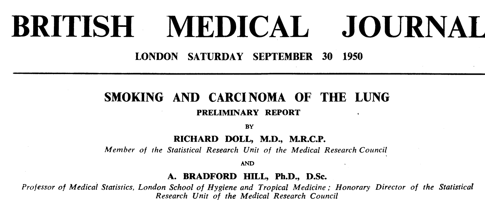

# Today's Class

- Introduction to causal inference
- The fundamental problem of causal inference
- The assignment mechanism
- Getting around the fundamental problem
- SUTVA
- Causal inference via randomization 

# Does smoking cause lung cancer?




# Introduction to causal inference - Bob's headache

- Suppose Bob, at a particular point in time, is contemplating whether or not to take an aspirin for a headache. 

- There are two treatment levels, taking an aspirin, and not taking an aspirin. 

- If Bob takes the aspirin, his headache may be gone, or it may remain, say, an hour later; we denote this outcome, which can be either “Headache” or “No Headache,” by $Y(\text{Aspirin})$.  

- Similarly, if Bob does not take the aspirin, his headache may remain an hour later, or it may not; we denote this potential outcome by $Y(\text{No Aspirin})$, which also can be either “Headache,” or “No Headache.” 

- There are therefore two potential outcomes, $Y(\text{Aspirin})$ and $Y(\text{No Aspirin})$, one for each level of the treatment. The causal effect of the treatment involves the comparison of these two potential outcomes.

# Introduction to causal inference - Bob's headache

Because in this example each potential outcome can take on only two values, the unit- level causal effect – the comparison of these two outcomes for the same unit – involves one of four (two by two) possibilities:


1. Headache gone only with aspirin:
 Y(Aspirin) = No Headache, Y(No Aspirin) = Headache
2. No effect of aspirin, with a headache in both cases: 
Y(Aspirin) = Headache, Y(No Aspirin) = Headache
3. No effect of aspirin, with the headache gone in both cases: Y(Aspirin) = No Headache, Y(No Aspirin) = No Headache
4. Headache gone only without aspirin:
Y(Aspirin) = Headache, Y(No Aspirin) = No Headache

# Introduction to causal inference - Bob's headache


There are two important aspects of this definition of a causal effect. 

1. The definition of the causal effect depends on the potential outcomes, but it does not depend on which outcome is actually observed. 

2. The causal effect is the comparison of potential outcomes, for the same unit, at the same moment in time post-treatment. 

- The causal effect is not defined in terms of comparisons of outcomes at different times, as in a before-and-after comparison of my headache before and after deciding to take or not to take the aspirin. 

# The fundemental problem of causal inference

“The fundamental problem of causal inference” (Holland, 1986, p. 947) is the problem that at most one of the potential outcomes can be realized and thus observed. 

- If the action you take is Aspirin, you observe $Y(\text{Aspirin})$ and will never know the value of $Y(\text{No Aspirin})$ because you cannot go back in time. 

- Similarly, if your action is No Aspirin, you observe $Y(\text{No Aspirin})$ but cannot know the value of $Y(\text{Aspirin})$.  

- In general, therefore, even though the unit-level causal effect (the comparison of the two potential outcomes) may be well defined, by definition we cannot learn its value from just the single realized potential outcome. 

# The fundemental problem of causal inference


The outcomes that would be observed under control and treatment conditions are often called **counterfactuals** or **potential outcomes**.

- If Bob took aspirin for his headache then he would be assigned to the treatment condition so $T_i = 1$ ($T_1=1$, if treatment is aspirin; $T_i=0$, if treatment is no aspirin).  

- Then $Y(\text{Aspirin})$ is observed and $Y(\text{No Aspirin})$ is the unobserved counterfactual outcome—it represents what would have happened to Bob if he had not taken aspirin. 

- Conversely, if Bob had not taken aspirin then $Y(\text{No Aspirin})$ is observed and $Y(\text{Aspirin})$ is counterfactual. 

- In either case, a simple treatment effect for Bob can be defined as
$$ \mbox{treatment effect for Bob }= Y(\text{Aspirin})-Y(\text{No Aspirin}).$$

- The problem is that we can only observe one outcome.

# The assignment mechanism

- **Assignment mechanism:** The process for deciding which units receive treatment and which receive control. 
- **Ignorable Assignment Mechanism:** The assignment of treatment or control for all units is independent of the unobserved potential outcomes (“nonignorable” means not ignorable)
- **Unconfounded Assignment Mechanism:** The assignment of treatment or control for all units is independent of all potential outcomes, observed or unobserved (“confounded” means not unconfounded)

# The assignment mechanism

- Suppose that a doctor prescribes drug (labeled 0) or surgery (labeled 1) for a certain condition.  
- The doctor knows enough about the potential outcomes of the patients so assigns each patient the treatment that is more beneficial to that patient.

unit         |  $Y_i(0)$  | $Y_i(1)$   |$Y_i(1) - Y_i(0)$   
-------------|------------|------------|-----------------
patient #1   |    1       |  7         |       6
patient #2   |    6       |  5         |      -1
patient #3   |    1       |  5         |       4
patient #4   |    8       |  7         |      -1
Average      |    4       |  6         |       2

$Y_i(0)$ is years of post-treatment survival after receiving drug and $Y_i(1)$ is years of post-treatment survival after receiving surgery.

# The assignment mechanism

- Patients 1 and 3 will receive surgery and patients 2 and 4 will receive drug treatment.
- The observed treatments and outcomes are in this table.

unit         |   $T_i$    | $Y_i^{obs}$ | $Y_i(1)$   |$Y_i(0)$ 
-------------|------------|-------------|------------|--------
patient #1   |      1     |  7          |            |        
patient #2   |      0     |  6          
patient #3   |      1     |  5         
patient #4   |      0     |  8         
**Average Drug** |            |  **7**
**Average Surg** |            |  **6**

- This shows that we can reach invalid conclusions if we look at the observed values of potential outcomes without considering how the treatments were assigned.
- The assignment mechanism depended on the potential outcomes and was therefore nonignorable (implying that it was confounded).


# The assignment mechanism

The observed difference in means is entirely misleading in this situation. The biggest problem when using the difference of sample means here is that we have effectively pretended that we had an unconfounded treatment assignment when in fact we did not. This example demonstrates the importance of finding a statistic that is appropriate for the actual assignment mechanism.

# The assignment mechanism

Is the treatment assignment ignorable (independent of unobserved potential outcomes)?

- The doctor knows enough about the potential outcomes of the patients so assigns each patient the treatment that is more beneficial to that patient.
- Suppose that a doctor prescribes surgery (labeled 1) or drug (labeled 0) for a certain condition by tossing a biased coin that depends on $Y(0)$ and $Y(1)$, where $Y$ is years of post-treatment survival.  
- If $Y_1(1) \ge Y_i(0)$ then $P(T_i=1|Y_i(0),Y_i(1))=0.8.$
- If $Y_i(1) < Y_i(0)$ then $P(T_i=1|Y_i(0),Y_i(1))=0.3.$


unit         |$Y_i(0)$| $Y_i(1)$| $p_1$                   |$p_0$   
-------------|--------|---------|-------------------------|------------------------
patient #1   |    1   |  7      |      0.8                | 0.2
patient #2   |    6   |  5      |      0.3                | 0.7
patient #3   |    1   |  5      |      0.8                | 0.2
patient #4   |    8   |  7      |      0.3                | 0.7

where, $p_1 =P(T_i=1|Y_i(0),Y_i(1))$,and $p_0=P(T_i=0|Y_i(0),Y_i(1))$. 
 


# Weight gain study

From Holland and Rubin (1983).

“A large university is interested in investigating the effects on the students of the diet provided in the university dining halls and any sex differences in these effects. Various types of data are gathered. In particular, the weight of each student at the time of his [or her] arrival in September and his [or her] weight the following June are recorded.”

- The average weight for Males was 180 in both September and June. Thus, the average weight gain for Males was zero.
- The average weight for Females was 130 in both September and June. Thus, the average weight gain for Females was zero.
- Question: What is the differential causal effect of the diet on male weights and on female weights?
- Statistician 1: Look at gain scores: No effect of diet on weight for either males or females, and no evidence of differential effect of the two sexes, because no group shows any systematic change.
- Statistician 2: Compare June weight for males and females with the same weight in September: On average, for a given September weight, men weigh more in June than women. Thus, the new diet leads to more weight gain for men.
- Is Statistician 1 correct? Statistician 2? Neither? Both?

# Weight gain study

Questions:

1. What are the units?
2. What are the treatments?
3. What is the assignment mechanism?
4. Is the assignment mechanism useful for causal inference?
5. Would it have helped if all males received the dining hall diet and all females received the control diet? 
6. Is Statistician 1 or Statistician 2 correct?


# Stable Unit Treatment Value Assumption (SUTVA)

To learn about causal effects through multiple experimental units assumptions are required.

**The assumption.** The potential outcomes for any unit do not vary with the treatments assigned to other units, and, for each unit, there are no different forms or versions of each treatment level, which lead to different potential outcomes.

# Stable Unit Treatment Value Assumption (SUTVA)


- Involves assuming that treatments applied to one unit do not affect the outcome for another unit. 

- For example, if Adam and Oliver are in different locations and have no contact with each other, it would appear reasonable to assume that if Oliver takes an an aspirin for his headache then his behaviour has no effect on the status of Adam's headache. 

- This assumption might not  hold if Adam and Oliver are in the same location, and Adam's behavior, affects Oliver's behaviour.  

- SUTVA incorporates the idea that Adam and Oliver do not interfere with one another and the idea that for each unit there is only a single version of each treatment level (e.g., there is only one dose of aspirin). (Imbens and Rubin, 2015)


# Getting around the fundemental problem by using close substitutes

- Are there situations where you can measure both $Y_i^0$ and $Y_i^1$ on the same unit?
- Drink tea one night and milk another night then measure the amount of sleep.  What has been assumed?
- Divide a piece of plastic into two parts then expose each piece to a corrosive chemical.  What has been assumed?
- Measure the effect of a new diet by comparing your weight before the diet and your weight after.  What has been assumed?
- There are strong assumptions implicit in these types of strategies.

# Getting around the fundemental problem by using randomization and experimentation

- Use the “statistical” idea of using the outcomes observed on a sample of units to learn about the distribution of outcomes in the population.
- The basic idea is that since we cannot compare treatment and control outcomes for the same units, we try to compare them on similar units. 
- Similarity can be attained by using randomization to decide which units are assigned to the treatment group and which units are assigned to the control group. 
- Why does randomization of treatments produce similar groups of units?  

# Getting around the fundemental problem by using randomization and experimentation

- It is not always possible to achieve close similarity between the treated and control groups in a causal study. 
- In *observational studies*, units often end up treated or not based on characteristics that are predictive of the outcome of interest (for example, men enter a job training program because they have low earnings and future earnings is the outcome of interest). 
- Randomized experiments can be impractical or unethical.
- When treatment and control groups are not similar, modeling or other forms of statistical adjustment can be used to *fill in the gap*. 

# Fisherian Randomization Test

- The randomization test is related to a stochastic proof by contradiction giving the plausibility of the null hypothesis of no treatment effect.
- The null hypothesis is $Y_i^0=Y_i(0)=Y_i(1)=Y_i^1$, for all units.
- Under the null hypothesis all potential outcomes are known from $Y^{obs}$ since $Y^{obs}=Y(1)=Y(0)$.
- Under the null hypothesis, the observed value of any statistic, such as ${\bar y}^1-{\bar y}^0$ is known for all possible treatment assignments. Why?
- The randomization distribution of ${\bar y}^1-{\bar y}^0$ can then be obtained.
- Unless the data suggest that the null hypothesis of no treatment effect is false then it's difficult to claim evidence that the treatments are different.


# Randomizing two treatments 

- Assigning treatments randomly avoids any pre-experimental bias.

- 12 playing cards, 6 red, 6 black were shuffled and dealt

- 1st card black $\rightarrow$ $1^{st}$ person (ie., experimental unit) receives treatment B

- 2nd card red $\rightarrow$ $2^{nd}$ person receives treatment A

- 3rd card black $\rightarrow$ $3^{rd}$ person receives treatment B

- Completely randomized design


# Example: HeartSteps Mobile Health Study

- Participants wore activity trackers and were randomized to receive or not receive push notifications to encourage walking.

- At each point, a participant was randomized to receive a **prompt** (Treatment A) or **no prompt** (Treatment B).

- Outcome: **step count** over the next 30 minutes.


# Propensity Score and Treatment Assignment

- The probability that an experimental unit receives treatment is called the **propensity score**. 

- In this case, the probability that an experimental unit receives treatment A (or B) is 1/2 or $P(T_i=1)= 1/2,$ where 

\[
T_i =
\begin{cases}
1 & \text{if treament A } \\
0 & \text{otherwise.}
\end{cases}
\]

- In general if there are $N$ experimental units and two treatment assignments then there are $2^N$ possible treatment assignments.

# Completely Randomized Design

- Let the total number of experimental units be $N=N_A+N_B$ with $N_A,N_B$ the totals assigned to treatments $A,B$.

- In a **completely randomized design**  the number of units assigned to treatment A, $N_A$, fixed in advance so that the number of units assigned to treatment B, $N_B=N-N_A$ is also fixed.

- Each unit has probability $N_A/N$ of being assigned to $A$.

- How many ways can $N_A$ experimental units be selected from $N$ experimental units such that order of selection doesn't matter and replacement is not allowed (i.e., a unit cannot be selected more than once)? 

# HeartSteps Step Count Data

\begin{table}[]
\centering
\label{step-data}
\begin{tabular}{|c|c|c|c|c|c|}
\hline
A 320 & B 210 & A 340 & B 250 & A 300 & A 310 \\ \hline
B 190 & A 330 & B 260 & B 240 & A 350 & B 200 \\ \hline
\end{tabular}
\end{table}


# HeartSteps Step Count Data

- Is there evidence that receiving a prompt is a source of variation in steps?

- Evidence about differences between two populations is generally measured by comparing summary statistics across two sample populations.

- A statistic is any computable function of the observed data.


# HeartSteps Study (ECDF)

Summarize the distribution using the empirical cumulative distribution function:

$${\hat F}_n(y)=\sum_{i=1}^{n}{\frac{I_{(y_i \le y)}}{n}}$$ (NB: $F_n(x) \overset{\mathrm{a.s.}}\longrightarrow F(x)$, for all fixed $x$, $F$ is the true CDF)

# HeartSteps Study (ECDF)

```{r, fig.height=3, fig.width=6, echo=TRUE}
yA <- c(320, 340, 300, 310, 330, 350) #group that received prompts 
yB <- c(210, 250, 190, 260, 240, 200) #group that did not receive prompts 
plot.ecdf(yB, xlab="Step Count", xlim=c(180, 360), verticals=TRUE,
          main="Empirical CDF: Step Counts")
plot.ecdf(yA, col="blue", pch=2, add=TRUE, verticals=TRUE)
legend("bottomright", legend=c("No Prompt (B)", "Prompt (A)"),
       col=c("black", "blue"), pch=1:2, cex=0.6)
```

# Summary Statistics

```{r}
summary(yA); sd(yA); quantile(yA, prob=c(0.25,0.75))
summary(yB); sd(yB); quantile(yB, prob=c(0.25,0.75))
```

# Results

Average difference in steps taken by people that received and did not receive prompts is:

```{r}
mean(yA) - mean(yB) 
```

- Prompts increased steps by about this many steps on average.
- Could this result be due to chance? 
- Does prompting *cause* people to get up and walk?


# Hypothesis Testing via Randomization

- Are observed step count differences due to prompting?
- Or due to natural fluctuations across participants (i.e., due to chance)?


# Hypothesis Testing Via Randomization

Hypothesis tests:

- $H_0$ (null hypothesis): $\mu_A - \mu_B=0$, $\mu_A,\mu_B$ are the population mean number of steps taken after 30 min under prompting and no prompting resp.

- $H_1$ (alternative hypothesis): $\mu_A - \mu_B>0$ prompting increases steps.

- A statistical hypothesis evaluates the compatibility of $H_0$ with the data

# Test Statistics and Null Distributions

We can evaluate $H_0$ by answering:

- Is a mean difference of 100 steps plausible/probable if H0 true?

- Is a mean difference of 100 steps large when compared against all possible random assignments?

# Test Statistics and Null Distributions

- Compare ${\bar y}_A-{\bar y}_B$=100 (observed difference in the experiment) to values of ${\bar y}_a-{\bar y}_b$ that could have been observed if $H_0$ were true.

- Hypothetical values of ${\bar y}_A-{\bar y}_B$ that could have been observed under $H_0$ are referred to as samples from the **null distribution**.


# Potential Outcomes

The cards were shuffled and we were dealt B, R, B, R, ...

\begin{table}[]
\centering
\label{my-label}
\begin{tabular}{|l|l|l|l|l|l|}
\hline
B  & A  & B  & A  & B  & B  \\ \hline
B  & A  & A  & A  & B  & A  \\ \hline
\end{tabular}
\end{table}

Under this treatment assignment we oberved the step counts:

\begin{table}[]
\centering
\label{my-label}
\begin{tabular}{|l|l|l|l|l|l|}
\hline
A 320 & B 210 & A 340 & B 250 & A 300 & A 310 \\ \hline
B 190 & A 330 & B 260 & B 240 & A 350 & B 200 \\ \hline
\end{tabular}
\end{table}

# Experimental Procedure and Potential Outcomes

Another potential treatment assignment under $H_0$ is: 

\begin{table}[]
\centering
\label{my-label}
\begin{tabular}{|l|l|l|l|l|l|}
\hline
B  & A  & B  & B  & A   & A  \\ \hline
A  & B  & B  & A  & A  & B  \\ \hline
\end{tabular}
\end{table}

The yields obtained under this assignment are:

\begin{table}[]
\centering
\label{my-label}
\begin{tabular}{|l|l|l|l|l|l|}
\hline
B 320 & A 210 & B 340 & B 250 & A 300 & A 310 \\ \hline
A 190 & B 330 & B 260 & A 240 & A 350 & B 200 \\ \hline
\end{tabular}
\end{table}

This data could occur if the experiment were run again.

# Experimental Procedure and Potential Outcomes

- Under this hypothetical assignment the mean difference is:

```{r}
yA <- c(210, 300, 310, 190, 240, 350)
yB <- c(320, 340, 250, 330, 260, 200)
mean(yA-yB)
```
This represents an outcome of the experiment in a universe where:

1. The treatment assignment is B, A, B, B, A, A, A, B, B, A, A, B

2. $H_0$ is true (i.e., $\mu_A=\mu_B$, where $\mu_A,\mu_B$ are the mean step counts of prompting (A) and no prompting (B)).

# The Null distribution

- What potential outcomes **could** we see if $H_0$ is true?

- Compute ${\bar y}_A-{\bar y}_B$ for each possible treatment assignment.

# The Null Distribution

- For each treatment assignment compute $$\delta_i={\bar y_A}-{\bar y_B}, i=1,2,\ldots,924.$$

- $\left\{\delta_1, \delta_2, \ldots, \delta_{924}\right\}$ enumerates all pre-randomisation outcomes assuming no treatment effect.

- Since each treatment assignment is equally likely under the null distribution, a probability distribution of experimental results if $H_0$ is true can be described as

$$\begin{aligned} 
{\hat F}_n(y) 
            &= \frac{\sum_{k=1}^{{\binom{12}{6}}}I({\delta_k \le y})}{\binom{12}{6}}
\end{aligned}$$


This is called the **randomization distribution**.


# Randomization Distribution

- Under $H_0$, outcomes are *invariant* to treatment assignment.

- Compute the mean difference in steps for each of the $\binom{12}{6} = 924$ ways to assign 6 people prompts and 6 people no prompts.

# R Code for Randomization Distribution

```{r, echo=TRUE, size="tiny"}

# original randomization

yA <- c(320, 340, 300, 310, 330, 350)
yB <- c(210, 250, 190, 260, 240, 200)

steps <- c(yA, yB); N <- choose(12, 6)

res <- numeric(N)

index <- combn(1:12, 6)

for (i in 1:N) {
  res[i] <- mean(steps[index[, i]]) - mean(steps[-index[, i]])
}

observed <- mean(yA) - mean(yB)

index[,1:4] #output first two randomizations
res[1:4] #output first two mean diffs
```

# Randomization Distribution Plot

```{r, echo=FALSE}
hist(res, xlab="Mean Difference (Prompt - No Prompt)",
     main="Randomization Distribution")
abline(v=observed, col="blue")
```

# Randomization Test

- Assume $H_0$ is true.

- Calculate the difference in means for every possible way to split the data into two samples of size 6.

- This would result in ${{12}\choose{6}}=924$ differences.

- Calculate the probability of observing a value as extreme of more extreme than the observed value of the test statistic (*P-value*).

- If the P-value is small then there are two possible explanations:

1. An unlikely value of the statistic has occurred, or

2. The assumption that $H_0$ is true is incorrect.

- If the P-value is large then the hypothesis test is inconclusive.  


# P-Value

```{r}
pval <- sum(res >= observed) / N
round(pval, 3)
```

- P-value = probability (under $H_0$) of observing a mean difference at least as large as `r round(observed, 2)`.

# Interpretation of Results

- If p-value is small, observed difference is unlikely assuming (under) $H_0$ is true.

- Suggests prompt **does increase** steps.

- Randomization allows causal conclusions. 

# Interpretation of P-value

- A p-value of `r round(pval,2)` can be interpreted as: assume there is no difference in steps between people who were and were not prompted then the proportion of randomizations that would produce an observed mean difference between A and B of at most `r round(observed,2)` is `r round(pval,3)`. 

- In other words, under the assumption that there is no difference between A and B only 0.1% of randomizations would produce an extreme or more extreme difference than the observed mean difference.  

- Therefore it's unlikely (if we consider 0.1% unlikely) that an observed mean difference as extreme or more extreme than `r round(observed,3)` would be observed if $\mu_A=\mu_B$.

# Issues with P-values

- P-values are often compared to a fixed significance level, $\alpha=P(\text{type I error})=0.05$ or $\alpha=0.01$. This leads to *rules* such as, *if the P-value $\le \alpha$* then the result is **statistically significant**. 

- The importance of statistical significance might be exaggerated or overemphasized in scientific studies.   

- If three scientists independently test a correct $H_0$ at a significance level of $\alpha=0.05$.  Then the probability of declaring that $H_0$ is significant in at least one test is 0.14.

